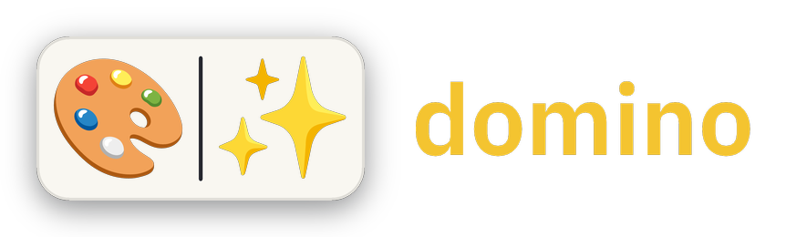

# Domino

Emoji logo generator.

Bundled emoji SVG assets and the default font are compiled into the binary, so `cargo install --path .` produces a self-contained executable.

Emoji artwork is [Noto Emoji](https://github.com/googlefonts/noto-emoji) (SIL OFL 1.1),
with a few Twemoji fallbacks (CC-BY 4.0). Apple's emoji are proprietary and not
bundled — to use genuine Apple artwork locally, export it as PNG sprites and pass
`--sprites-dir` (see [THIRD_PARTY_NOTICES.md](THIRD_PARTY_NOTICES.md)).

## Install

```bash
cargo install --path .
```

## Usage

```bash
domino --emojis "🦆🎱" --text "duckeight" --color f4a030 -o logo.png
```

Emoji are rendered crisp (full-detail, antialiased) and housed in a **domino
tile** — a soft rounded plate split into one cell per emoji by a contrasting
divider, with a gentle drop shadow — turning the pair into a single,
self-contained mark that reads on any background. The tool name is set beside it
in a clean modern font (IBM Plex Sans). Works best with exactly two emoji.

### Options

- `--emojis` — emoji characters to render
- `--text` — text to display next to the emojis
- `--size N` — emoji box size in pixels (default: 150)
- `--badge true|false` — house the emoji in a domino tile (default: true)
- `--badge-fill HEX` — tile fill color (default: ivory `f9f7f1`); divider/border auto-contrast
- `--color FFCC4D` — 6-digit text color hex (default: white)
- `--text-scale F` — text size as a fraction of the emoji box height (default: 0.72)
- `--tracking N` — extra letter spacing in pixels (default: 0)
- `--font path.ttf` — custom font override
- `--sprites-dir path/` — custom sprite PNGs by emoji codepoints, e.g. `1f986.png` or `1f1eb-1f1f7.png`
- `--format png|svg` — output format; svg embeds the render as a data-URI PNG (default: png)
- `-o path` — output file

See `domino --help` for all options.
